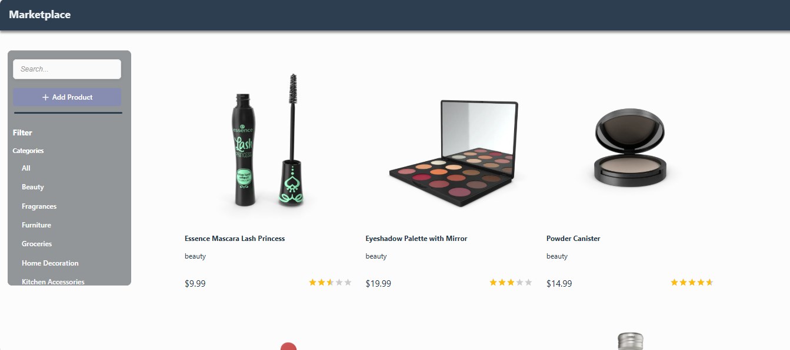
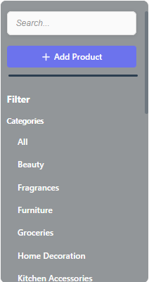
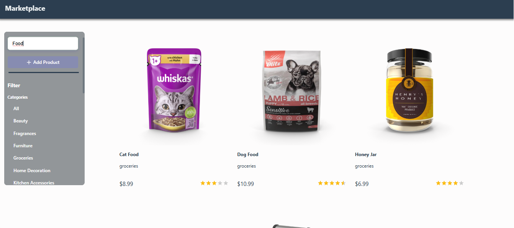
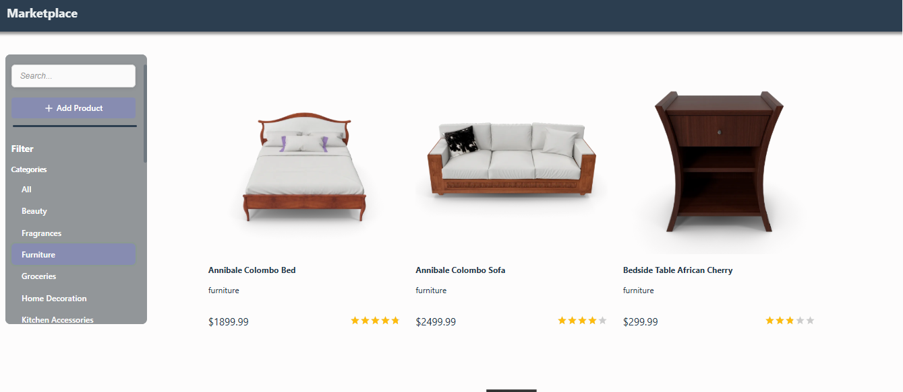
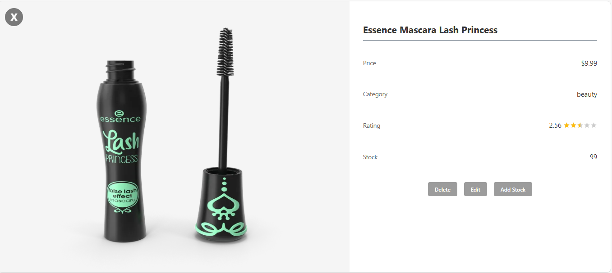
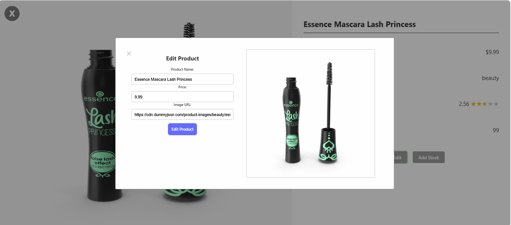
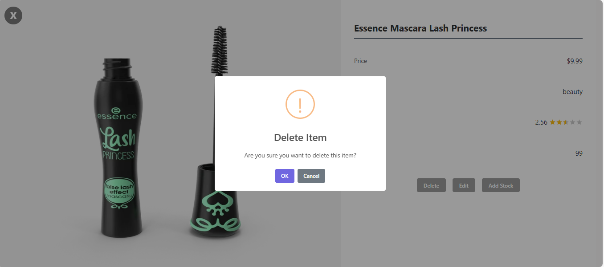
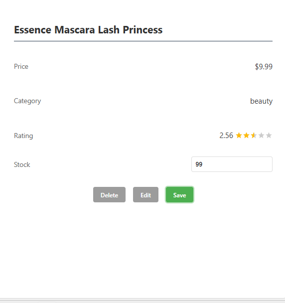
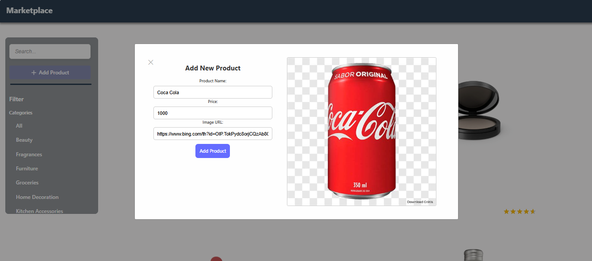

# Proyecto Prueba Técnica Sana Health Technologies

Este proyecto fue creado utilizando **Vite** como bundler y **React** como librería principal para la construcción de la interfaz de usuario.

## 📷 Capturas

### Página principal


### Filtros
--Los filtros se basan en las diferentes categorías que existen, además de poder buscar productos por el nombre


### Filtro por búsqueda


### Filtro por categoría


### Vista detallada del producto


### Editar un producto


### Eliminar un producto


### Aumentar Stock de un producto


### Agregar un producto



## 📦 Requisitos previos

Requisitos para montar el proyecto:

Tener:
* **Node.js** 
* **npm**

Puedes verificarlo ejecutando:

```bash
node -v
npm -v
```

---

## 🚀 Pasos para levantar el proyecto

1. **Clonar el repositorio**

```bash
git clone https://github.com/FabMolina05/prueba_tecnica_sana.git
```

2. **Entrar al directorio del proyecto**

```bash
cd Sana
```

3. **Instalar dependencias**

```bash
npm install
```

> También puedes usar `yarn install` si prefieres Yarn.

4. **Levantar el servidor de desarrollo**

```bash
npm run dev
```

5. **Abrir el proyecto en el navegador**

Por defecto, Vite levanta el proyecto en:

```
http://localhost:5173
```

---

## 🛠️ Tecnologías utilizadas

* **Vite**
* **React**
* **React Router DOM**
* **Font Awesome**
* **SweetAlert2**

* Se decidió usar la herramiento de compilación **Vite** por la previa experiencia con esta herramienta.
* Se usó las librerias de **Font Awesome** y **SweetAlert2** por la facilidad que provee a la hora de montar CSS
---

## 📚 Dependencias principales

Las siguientes dependencias fueron utilizadas en el proyecto:

```json
{
  "@fortawesome/fontawesome-svg-core": "^7.1.0",
  "@fortawesome/free-brands-svg-icons": "^7.1.0",
  "@fortawesome/free-regular-svg-icons": "^7.1.0",
  "@fortawesome/free-solid-svg-icons": "^7.1.0",
  "@fortawesome/react-fontawesome": "^3.1.1",
  "@fortawesome/vue-fontawesome": "^3.1.3",
  "font-awesome": "^4.7.0",
  "react": "^19.2.0",
  "react-dom": "^19.2.0",
  "react-router-dom": "^7.13.0",
  "react-simple-star-rating": "^5.1.7",
  "sweetalert2": "^11.26.18"
}
```

---

## 📦 Scripts disponibles

```bash
npm run dev       # Inicia el servidor de desarrollo

```

---

## 📄 Notas adicionales

* El proyecto está configurado para desarrollo rápido y hot reload gracias a Vite.
* Se utilizan alertas visuales con **SweetAlert2**.
* Los íconos se manejan mediante **Font Awesome**.
* Para la visualización del rating en estrellas se uso **react-simple-star-rating**

---

✍️ **Autor**

Desarrollado por Fabian Molina Sanchez
